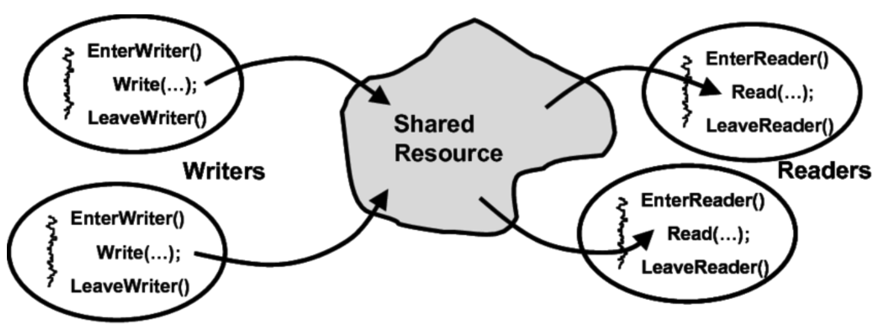

# Starve Free Reader Writer Problem

# Table of Contents
1. [Introduction](#introduction)
2. [What is Reader Writer Problem](#what-is-reader-writer-problem)
3. [What is Starvation](#what-is-starvation)
4. [Classical Reader Writer Solution](#classical-reader-writer-solution)
    - i. [Data Structures](#data-structure)
    - ii. [Classical Pseudocode](#classical-pseudocode)
5. [Problem in Classical Solution](#problem-in-classical-solution)
6. [Starve Free Solution](#starve-free-solution)
   - i. [Solution](#solution)
   - ii. [Data Structures](#data-structures)
   - iii. [Starve free Pseudocode](#starve-free-pseudocode)
7. [Correctness of Starve Free Solution](#correctness-of-starve-free-solution)
8. [References](#references)

<br>
<hr>

# Introduction
This repository contains the implementation of Starve Free Reader Writer Problem. The following sections describe the problem and the solution along with the pseudocode implementation and the correctness proof.

<hr>
<br>

# What is Reader Writer Problem

* Computer science's most well-known synchronisation issue is the reader-writer problem. It describes a scenario in which numerous threads or processes need to access a same resource, like a file or a database, with some threads only reading from it and others also writing to it. When a writer thread makes changes to a shared resource, it can possibly contaminate the data that other threads are simultaneously accessing as readers. The reader-writer problem aims to create a method that permits numerous readers to access a shared resource concurrently while assuring that only one writer can access it at a time, maintaining its security and consistency.

<br>



<hr>
<br>

# What is Starvation
* Starvation is a situation that can occur in computer systems when a process or thread is unable to access a shared resource or obtain the required resources necessary to complete its work, resulting in the process being blocked indefinitely.

* Starvation can occur due to various reasons such as improper resource allocation, inefficient scheduling algorithms, or high resource demand from other processes or threads. In a starvation scenario, the process or thread may be waiting for a long time to acquire a resource that is being held by another process, causing it to be blocked and unable to proceed.

* Starvation can have adverse effects on the performance and efficiency of the system, leading to decreased throughput and increased latency. Therefore, it is essential to design efficient resource allocation and scheduling algorithms to prevent starvation and ensure fair access to resources for all processes and threads in the system.

<br>
<hr>

# Classical Reader Writer Solution
* The classical solution to the reader-writer problem is to use a mutex lock to ensure that only one thread can access the shared resource at a time. This solution is simple and easy to implement, but it has a major drawback: it can lead to starvation. If a writer thread is waiting to access the shared resource, it will be blocked until all the reader threads have finished reading from the resource. This can lead to a situation where the writer thread is blocked indefinitely.

<hr>

## Data Structure
* The data structures used in the classical solution are as follows:

```cpp
int readcount = 0;     // number of readers
semaphore mutex = 1;  // mutex lock for critical section
semaphore db = 1;    // mutex lock for shared resource
```

<hr>

## Classical Pseudocode
* The pseudocode for the classical solution is as follows:

### Reader (Classical)
```cpp
// This function is executed by the reader threads
void reader()
{
    while(true)
    {
        wait(mutex);          // acquire mutex lock
        readcount++;          // increment the number of readers
        if(readcount == 1)    // if this is the first reader
            wait(db);         // acquire lock to shared resource
        signal(mutex);        // release mutex lock

        /*************************/
        /*   CRITICAL SECTION   */
        /*************************/

        wait(mutex);          // acquire mutex lock
        readcount--;          // decrement the number of readers
        if(readcount == 0)    // if this is the last reader
            signal(db);       // release lock to shared resource
        signal(mutex);        // release mutex lock
    }
}
```

### Writer (Classical)
```cpp
// This function is executed by the writer threads
void writer()
{
    while(true)
    {
        wait(db);             // acquire lock to shared resource

        /*************************/
        /*   CRITICAL SECTION   */
        /*************************/

        signal(db);           // release lock to shared resource
    }
}
```

<hr>
<br>

# Problem in Classical Solution
* In the classical reader-writer problem, starvation can occur when a writer thread is continuously requesting access to the shared resource, but the reader threads are constantly being given priority by the system scheduler.

* If the system scheduler always prioritizes the reader threads, then the writer thread may be starved of access to the shared resource, leading to a situation where the writer thread may be blocked indefinitely, unable to modify the shared resource. This can result in a system deadlock or reduced system performance as the writer thread waits for access to the resource.

* To avoid starvation in the reader-writer problem, it is essential to implement a `fair scheduling algorithm` that gives equal access to the shared resource to both reader and writer threads. One possible solution is to use a `queue` or `semaphore` to store the threads that are waiting to access the shared resource. This ensures that the threads are served in a `first-come-first-serve` manner, preventing starvation from occurring.

<hr>
<br>

# Starve Free Solution
* The starve free solution to the reader-writer problem is to use a `queue` to store the threads that are waiting to access the shared resource. This ensures that the threads are served in a `first-come-first-serve` manner, `preventing starvation` from occurring. This solution is more complex than the classical solution, but it ensures that the writer threads are not starved of access to the shared resource.
* For this solution we have to update the `reader` and `writer` functions as well as the `data structures` and `Semaphores` used in the classical solution.

<hr>

## Solution
* This solution uses a `first-come-first-serve` scheduling algorithm to ensure that the threads are served in a fair manner, preventing starvation from occurring. `Semaphores` are used to solve the problem of process synchronization. The semaphore is linked to a critical section and contains a `Queue (FIFO structure)` that stores the list of processes that are `blocked` and `waiting` to acquire the semaphore.


<hr>

## Data Structures
* The data structures used in the starve free solution are as follows:
1. Process class 
2. Queue class for blocked processes/threads
3. Semaphore class
4. Wakeup function
5. Signal function
6. Wait function

<br>

1. Process class
```cpp
class Process
{
    public:
        process* next;       // pointer to next process
        int ID;              // process ID
        bool state = true;   // blocked = false, ready = true

    // helper functions like constructor, destructor, getter and setters
};
```

<br>

2. Queue class for blocked processes/threads
```cpp
class blockedQueue {
    int size = 0;
    process *front, *back;

    public :
        void push(int id) 
        {
            process *newProcess = new process(id);
            if (size == 0) 
            {
                front = back = newProcess;
            } 
            else 
            {
                back->next = newProcess;
                back = newProcess;
            }
            size++;
        }

        process* pop() 
        {
            if (size == 0) 
            {
                return NULL;
            }
            process *temp = front;
            front = front->next;
            size--;
            return temp;
        }
};
```

<br>

3. Semaphore class
```cpp
class Semaphore
{
    public:
        int value;           // semaphore value
        blockedQueue* queue; // queue of blocked processes

        Semaphore(int value)
        {
            this->value = value;
            this->queue = new blockedQueue();
        }
};
```

<br>

4. Wakeup function
```cpp
void wakeup(Semaphore* semaphore)
{
    process* process = semaphore->queue->pop();
    if(process != NULL)
    {
        process->state = true;
    }
}
```

<br>

5. Signal function
```cpp
void signal(Semaphore* semaphore)
{
    semaphore->value++;
    if(semaphore->value <= 0)
    {
        wakeup(semaphore.blockedQueue.pop());
    }
}
```

<br>

6. Wait function
```cpp
void wait(Semaphore* semaphore, process* process)
{
    semaphore->value--;
    if(semaphore->value < 0)
    {
        process->state = false;
        semaphore->queue->push(process);
        while(process->state == false);
    }
}
```

<br>
<hr>

## Starve Free pseudocode
* The pseudocode for the starve free solution is as follows:

### Initialization
```cpp
int resource = 1;                            // shared resource
int readcount = 0;                           // number of readers
Semaphore* mutex = new Semaphore(resource);  // mutex lock for critical section
Semaphore* read_mutex = new Semaphore(resource);  // mutex lock for readcount
Semaphore* write_mutex = new Semaphore(resource); // mutex lock for writer
```


### Reader (Starve Free)
```cpp
// This function is executed by the reader threads
void reader(process* process)
{
    while(true)
    {
        wait(mutex, process);          // acquire mutex lock
        wait(read_mutex, process);     // acquire read_mutex lock
        readcount++;                   // increment the number of readers
        if(readcount == 1)             // if this is the first reader
            wait(write_mutex, process); // acquire lock to shared resource
        signal(read_mutex);            // release read_mutex lock

        signal(mutex);                 // release mutex lock
    
        /*************************/
        /*   CRITICAL SECTION   */
        /*************************/

        wait(read_mutex);              // acquire read_mutex lock
        readcount--;                   // decrement the number of readers
        if(readcount == 0)             // if this is the last reader
            signal(write_mutex);       // release lock to shared resource
        signal(read_mutex);            // release read_mutex lock
    }
}
```


### Writer (Starve Free)
```cpp
// This function is executed by the writer threads
void writer(process* process)
{
    while(true)
    {
        wait(mutex, process);          // acquire mutex lock
        wait(write_mutex, process);    // acquire lock to shared resource
        signal(mutex);                 // release mutex lock

        /*************************/
        /*   CRITICAL SECTION   */
        /*************************/

        signal(write_mutex);           // release lock to shared resource
    }
}
```

<br>
<hr>

# Correctness of the Starve Free Solution
* For the solution to be correct it must satisfy the conditon of Mutial Exclusion, Progress and Bounded Waiting. The correctness of the solution is as follows:


## Mutual Exclusion
* The entry mutex works on First come first serve basis. So, the there is no chance of starvation of any thread as they will get the chance to enter the critical section in the order they arrived without any priority or biasedness. Also the `mutex` lock ensures that only one thread can enter the critical section at a time, thus ensuring mutual exclusion.


## Progress
* Progress means that there will not be any situation where any thread will be in a `deadlock` state that is indefinitely waiting for resource.
* In our solution the `mutex`, `read_mutex` and `write_mutex` locks ensure that the threads are not in a deadlock state. The `mutex` lock ensures that only one thread can enter the critical section at a time. The `read_mutex` lock ensures that only one thread can access the `readcount` variable at a time. The `write_mutex` lock ensures that only one thread can access the shared resource at a time.


## Bounded Waiting
* Bounded waiting means that the waiting time for a thread to enter the critical section is bounded(finite) and is not indefinite.
* In our solution the `FCFS Scheduling Algorithm` ensures that no process is prioritized over the other and hence there is no chance of indefinite waiting for a resource.

<br>
<hr>

# References
1. [Reader Writer problem](https://en.wikipedia.org/wiki/Readers%E2%80%93writers_problem)
2. [Solution to Reader Writer problem](https://arxiv.org/ftp/arxiv/papers/1309/1309.4507.pdf)
3. [Textbook for OS, Modern Operating Systems by Andrew S Tanenbaum](https://csc-knu.github.io/sys-prog/books/Andrew%20S.%20Tanenbaum%20-%20Modern%20Operating%20Systems.pdf)
4. [Research Gate](https://www.researchgate.net/figure/Readers-Writers-problem_fig4_237619066)